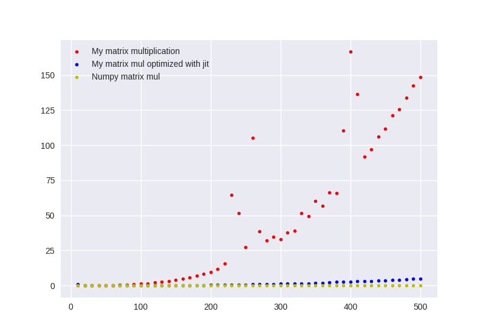
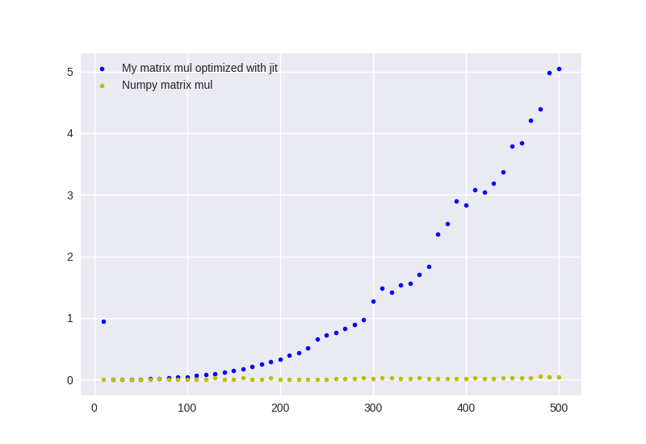
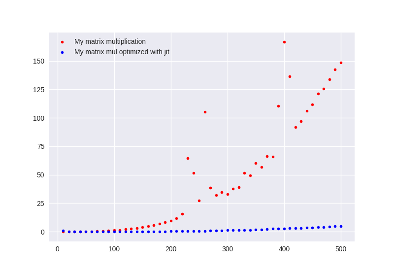
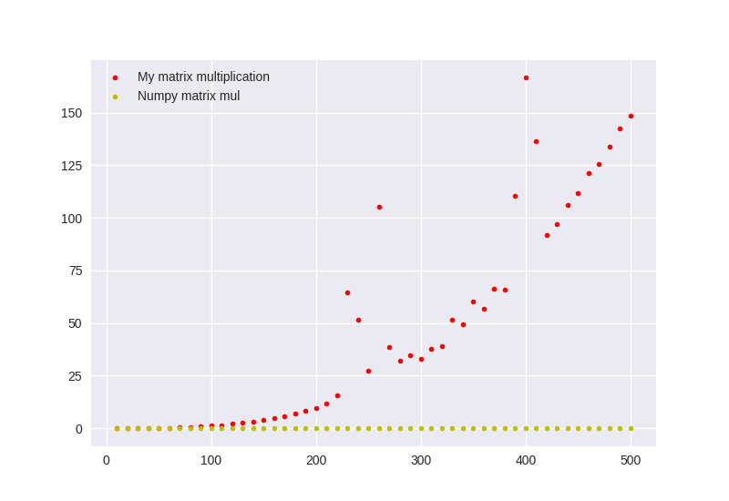

# GCI Matrix Multiplication

Matrix multiplication program written in python3 and compared to jit optimized version and numpy.

# Usage

`matmul.py` contains the functions and their `numba.jit` optimized versions.


`time_matmul.py` measures the time it takes in seconds to do matrix multiplication on NxN matrices on themeselves. It stores the input size N, and the time it takes to do a matmul on a random NxN matrix by itself, for input sizes from 10 until `max` argument. The results are stored in:

* `matmul.txt` for my matrix multiplication

* `matmul_jit.txt` for my matrix multiplication but optimized with `numba.jit`

* `matmul_numpy.txt` for numpy matrix multiplication.

```bash
python3 time_matmul.py -h
usage: time_matmul.py [-h] [--jit | --numpy] [max]

Timing matrix multiplication functions. Output saved to matmul.txt,
matmul_jit.txt, matmul_numpy.txt

positional arguments:
  max          loop from 10 with a step of 10 till this number, default is 500

optional arguments:
  -h, --help   show this help message and exit
  --jit, -j    Time the numba jit optimized version of my matmul
  --numpy, -n  Time the numpy version of matmul

```

 `display.py` renders the measurements from these files using matplotlib

```bash

python3 display.py -h
usage: display.py [-h] [--jit] [--numpy] [--normal]

Compare times vs input for matrix multiplication using matplotlib

optional arguments:
  -h, --help    show this help message and exit
  --jit, -j     Display jit
  --numpy, -n   Display numpy
  --normal, -c  Display my matrix multiplication

```

# Results

## All

`python3 display.py --normal --jit --numpy`




## Numpy and my matmul optimized with jit

`python3 display.py --jit --numpy`



## My matmul normally and optimized by jit

`python3 display.py --normal --jit`



## My matmul and Numpy Matmul

`python3 display.py --numpy --normal`




